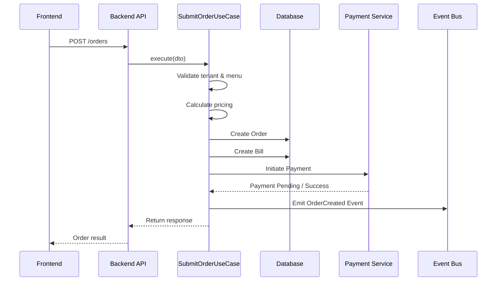

# XFOS — The Complete MVP PRD & Technical Design

**Product:** Multi-Tenant Food Ordering Platform
**Version:** 1.0
**Date:** 2026-04-09
**Goal:** You should understand *what* we're building, *why* every major decision was made, *how* it works, and *how* to add a feature without breaking it.

## Table of Contents
>
>1. [Section 1: Product (XFOS)](#section-1-product-xfos)
>2. [Section 2: The Architecture / Technical Design](#section-2-the-architecture--technical-design)
>3. [Section 3: Why BFF?](#section-3-why-bff)
>4. [Section 4: The Domain Layer](#section-4-the-domain-layer)
>5. [Section 5: The Tech Stack](#section-5-the-tech-stack)
>6. [Section 6: The Folder Structure](#section-6-the-folder-structure)
>7. [Section 7: Non-Negotiable Rules](#section-7-non-negotiable-rules)
>8. [Section 8: How a Feature Flows](#section-8-how-a-feature-flows)
>9. [Section 9: Alternatives We Rejected](#section-9-alternatives-we-rejected)
>10. [Section 10: The Roadmap](#section-10-the-roadmap)
>11. [Section 11: How To Use](#section-11-how-to-use)
>
---

# Section 1: Product (XFOS)
---
**Product Name** : XFOS (**X**Water **F**ood **O**rdering **S**ystem)
**Official Name** : TBD
**Product Type** : Multi-Tenant Web-Based Ordering System for Restaurants via QR-Code

---

## 1.1 Product Overview

### 1.1.1 Production Definition

**XFOS (XWater Food Ordering System)** is a multi-tenant SaaS platform for the Cambodian food-stall, kiosk, and dine-in restaurant markets.

Customers scan a QR code with their phone, browse the menu in Khmer or English, place an order, and pay.

The kitchen sees the order in real time on a tablet and from an order-ticket via a printer.

Merchants can manage their storefronts and their menu, their team, generate QRs code via the merchant-admin portal.

System-admin manages tenants and system health via platform-admin portal.

**Why This Market?**
- Cambodia's restaurant sector is overwhelmingly small operators — stalls, kiosks, family-run dine-in spots.
- They cannot afford a custom mobile app, and customers won't install one anyway.
- A QR-driven mobile-web experience is the right shape: zero install, zero login, zero friction.
- Khmer-first language support is non-negotiable here.

### 1.1.2 Target Customers

- Small to mid-sized restaurants
- Cafés / Casual Dining
- Environments with table-based ordering or counter ordering

### 1.1.3 Core Value Proposition

- Zero-install ordering for customers
- Minimal onboarding for restaurants
- Real-time order visibility for staff

---
## 1.2 Product Scopes

### 1.2.1 **In Scope (MVP)**
- QR-based storefront app, Khmer + English, mobile-optimized
  - Two operational models: 
    - **kiosk** (order → pay at counter → eat) and 
    - **dine-in** (multiple rounds → one bill → pay at end)
  - Dine-in session continuity (re-scan same table → resume the existing tab, not a new order)
  - Customer can opt in/out to receive their order history in telegram
- Kitchen real-time ticket flow (NEW → PREPARING → READY → COMPLETED)
- Merchant self-configuration (menu, QR codes, translations, team)
- Payment type both cash and digital payment (QR-code with ABA)

### 1.2.2 **Out of Scope**
- Digial card payment (both credit and debit card)
- Customer accounts / login for storefront app.
- Pickup, delivery, marketplace, CRM, Multi-location (i.e. one tenant with multiple branches)

### 1.2.3 Product Surfaces

There are **4 frontend apps** and **one backend app**.

| Surface | Who Uses It | Where | Tech |
|---|---|---|---|
| **Storefront App** | Customers | Their phone (mobile web, QR-accessed) | Next.js 14, no login |
| **Kitchen App (KDS)** | Kitchen staff | Tablet PWA on the wall | Next.js 14 PWA, real-time tickets |
| **Merchant Portal (Admin)** | Restaurant owners, managers | Desktop / tablet | Next.js 14, full back-office, login via telegram |
| **Platform Portal** | XFOS internal ops team | Internal browser, IP-allowlisted | Next.js 14, fully isolated |
| **Backend App** | Frontend Apps | Internal Accesss | Nestjs |

## 1.3 Goals & Success Criteria

### Business Goals (MVP)

- Enable restaurants to accept orders digitally via QR or menu-code input.
- Enable staff to process orders efficiently
- Prove system reliability under real usage

### Technical Goals

- Clean multi-tenant isolation
- Strict role-based access
- Extensible domain model (no rewrites later)

### MVP Success Criteria
**High-level targets:**
- Restaurant can onboard in <30 minutes
- Customer can place order in <2 minutes
- Staff can process orders without page refresh
- No cross-tenant data leaks (non-negotiable)

**Acceptance checklist — the MVP is done when all of these are true:**
- [ ] Customer scans QR code and reaches the correct restaurant storefront
- [ ] Storefront displays content in Khmer and English
- [ ] Customer browses categories and items on mobile browser
- [ ] Customer submits an order (no account required)
- [ ] Kiosk order reaches kitchen only after payment is confirmed — ABA QR: on webhook confirmation; cash: on counter staff tapping "Confirm Cash Received" in the kitchen app
- [ ] Dine-in order goes to kitchen immediately, session tracks multiple rounds
- [ ] Re-scanning a dine-in QR resumes the existing session (no duplicate session)
- [ ] Order status page loads for a valid order token and reflects current kitchen status
- [ ] Kiosk: re-scanning the same tenant QR within TTL shows "Your orders this visit" banner with all same-visit orders
- [ ] Kiosk: placing a second order during the same visit adds it to the banner without removing the first
- [ ] Kitchen app receives tickets in real time (Socket.io)
- [ ] Kitchen staff can advance ticket status: NEW → PREPARING → READY → COMPLETED
- [ ] Merchant creates categories, items, and Khmer translations without help
- [ ] Merchant generates and downloads/prints QR codes
- [ ] Tenant isolation verified — no cross-tenant data visible on any surface

---

## 1.4 User Roles & Permissions

### 1.4.1 Customer (Anonymous)

- Access menu via QR or menu-code printed on the physical menu.
- View menu items for details
- Add items to cart
- Submit order
- Opt in/out to receive order history via telegram
- rescan the code to retrieve to confirm their order history if browser closed
- No authentication

### 1.4.2 Restaurant Owner (Tenant Admin)

- Manage restaurant profile
- Create / manage menu contexts
- Manage menu items
- View all orders
- Manage staff users
- Generate QR code

### 1.4.3 Staff (Waiter / Chef)

- View incoming orders
- Update order status
- No menu editing
- No admin access

### 1.4.4 Platform Admin

- Approve / suspend restaurants
- View all tenants
- View system metrics
- Emergency kill switch

---

# Section 2: The Architecture / Technical Design

---
## The Hard Rule

> *"If a restaurant cannot operate daily using this system, MVP has failed."*
> *"Ship a high-quality, bug-free, sleek, production-ready MVP or die trying."*
>
A real restaurant in Phnom Penh has to open in the morning, take orders all day, feed customers, and close — using nothing but our platform and a printer for receipts.

---

### 2.1 — Key Concept : Design Around Use Cases, Not CRUD

Consider the “Submit Order” flow:

- Validate tenant
- Validate menu items
- Calculate pricing (tax, modifiers)
- Create order
- Create bill
- Initiate payment
- Emit events
- Handle async confirmation

This is **not a simple CRUD operation**.  
It is a **stateful, multi-step business transaction** with side effects and failure handling.

---

### Why a Pure CRUD Approach Breaks Down

A typical CRUD-style backend exposes database tables directly:

- `POST /orders`
- `PATCH /menu-items/:id`
- `GET /bills/:id`

This leads to:

- Business logic scattered across frontend, controllers, and SQL
- Multiple API calls for a single user action  
  (e.g., `createOrder → createBill → initiatePayment`)
- No clear transaction boundary
- Complex retry and rollback logic pushed to the frontend

> The issue is not CRUD itself —  
> the issue is exposing low-level operations instead of business actions.

---

### Our Approach: Use Case–Driven Backend

We design the backend around **user actions (use cases)**, not database tables.

Examples:

- `SubmitOrderUseCase`
- `MarkTicketReadyUseCase`
- `CompleteOnboardingUseCase`

Each use case:

- Encapsulates all business logic
- Orchestrates multi-step operations
- Defines a clear transaction boundary
- Handles failures and retries
- Emits domain events

The frontend calls **one use case per user action**.

---

#### Controller Example

```ts
@Post('/orders')
submitOrder(dto) {
  return this.submitOrderUseCase.execute(dto)
}
```

#### Sequence Diagram - Submit Order



### 2.2 — The Five Layers

```
┌──────────────────────────────────────────┐
│  Frontend (Next.js)                      │  Storefront, Kitchen, Admin, Platform-Admin
└──────────────────┬───────────────────────┘
                   │ HTTPS / WebSocket
┌──────────────────▼───────────────────────┐
│  BFF (Backend-for-Frontend)              │  One module per frontend, lives inside the API
└──────────────────┬───────────────────────┘
                   │ in-process DI call
┌──────────────────▼───────────────────────┐
│  Application Layer (Use Cases)           │  SubmitOrderUseCase.execute(...)
└──────────────────┬───────────────────────┘
                   │
┌──────────────────▼───────────────────────┐
│  Domain Layer (Business Rules)           │  Order, Catalog, Billing, Kitchen, ...
└──────────────────┬───────────────────────┘
                   │
┌──────────────────▼───────────────────────┐
│  Infrastructure (Prisma → PostgreSQL)    │  Repositories, Redis, BullMQ, Socket.io
└──────────────────────────────────────────┘
```

**Each layer has one job. No layer reaches across the line.**

| Layer | Owns |
|---|---|
| Frontend | What the user sees |
| BFF | The shape of the response for that one frontend |
| Use Case | How a goal is achieved (the workflow) |
| Domain | What is allowed to be true (business rules) |
| Infrastructure | State over time (database, cache, queues) |

### 2.3 — One Backend, Four Frontends

All four Next.js apps call the same NestJS backend, but each one talks to its own BFF prefix:

```
Storefront        →  /api/v1/storefront/*
Kitchen App       →  /api/v1/kitchen/*
Merchant Portal   →  /api/v1/admin/*
Platform Portal   →  /api/v1/platform-admin/*
                       ↓
                  Domain modules (Order, Catalog, Billing, Kitchen, ...)
```

**Why one backend?**
- Because there's only one truth. 
- A menu item exists once. An order exists once. A bill exists once. Splitting the backend by frontend would mean syncing the same data four times.

**Why four BFFs?**
- Because the four frontends need different shapes of the same data. 
- The storefront shouldn't see merchant cost.
- The kitchen doesn't need pricing.
- The admin needs everything.
- The platform-admin needs cross-tenant aggregates the others can't see.

### 2.4 — Multi-Tenancy: Defense in Depth (Application-Layer Isolation)

Every record in the system is scoped to a tenant.  
Preventing cross-tenant data leakage is a **critical system requirement**.

We enforce tenant isolation using **defense in depth across three application-layer controls**:

---

#### 1. Tenant Guard (Authentication Layer)

- Extracts `tenantId` from trusted JWT claims
- Injects tenant context into the request lifecycle
- Rejects any attempt to supply `tenantId` from client input

> Tenant identity is derived exclusively from trusted authentication, never from user input.

---

#### 2. Repository Layer (Explicit Query Scoping)

- All tenant-scoped queries must explicitly include a tenant filter  
  Example: `WHERE tenant_id = ?`

- No implicit filtering  
- No exceptions  

> Tenant isolation is enforced at the data access boundary, not delegated to higher layers.

---

#### 3. Prisma Middleware (Safety Enforcement)

- Intercepts all ORM queries  
- Detects missing tenant filters on tenant-scoped tables  
- Throws errors in development and test environments  
- Logs and alerts in production  

> This acts as a safeguard against accidental omissions or developer error.

---

### Guarantees and Limitations

This layered approach ensures that a cross-tenant data leak would require **multiple independent safeguards to fail simultaneously**.

However, this guarantee depends on:

- Consistent use of the repository layer  
- Proper middleware coverage  
- Controlled use of raw SQL queries  

To mitigate risks:

- Raw queries are restricted and reviewed  
- Repository patterns are standardized  
- Automated tests validate tenant isolation behavior  

---

### Why Not Use Postgres Row-Level Security (RLS)?

Postgres Row-Level Security (RLS) provides **database-level enforcement of tenant isolation** and is a valid alternative.

In this system, we prioritize **application-layer enforcement** due to:

- Greater transparency and explicitness in code  
- Simpler testing without requiring database session context  
- Better compatibility with Prisma ORM and migration workflows  
- Flexibility in implementing custom authorization logic  

---

### Tradeoff

This approach trades some **database-enforced guarantees** for **clarity, flexibility, and developer control**.

> RLS enforces isolation implicitly at the database level,  
> while this design enforces isolation explicitly at the application level.

---

### Key Principle

> **Tenant isolation must be explicit, consistently enforced, and continuously validated across all data access paths.**
---

## Section 3: Why BFF?

### 3.1 — The CRUD Trap

Imagine the storefront page that shows the menu. With a CRUD-first backend it would need:

```
GET /tenants/abc-coffee        → tenant info, theme
GET /tenants/abc-coffee/menu   → menu categories
GET /menu-items?tenant=abc...  → items
GET /tables/table-7            → table info (for dine-in)
```

Four round trips for one page. Each one a chance for a stale read. The frontend has to know about the shape of every domain entity. Adding a new field to the menu means updating both backend and frontend in lockstep.

This breaks down further when:
- Storefront wants prices in customer-facing currency, kitchen wants nothing about prices, admin wants margin
- A new screen needs to combine `Order` + `Bill` + `KitchenTicket` — now you need a fifth round trip
- Renaming a field in `Order` breaks every frontend that ever read it

### 3.2 — The BFF Solution

Instead, each frontend talks to its own BFF:

```
GET /api/v1/storefront/context/:slug
↓
StorefrontBFF.getContext():
   tenant   = tenantService.findBySlug(slug)
   menu     = catalogService.getActiveMenu(tenant.id)
   table    = tenant.dineIn ? tableService.find(tableId) : null
   return { tenant, menu, table }   ← one payload, UI-shaped
```

**One round trip, one payload, exactly what the storefront needs.**

The BFF is a thin module inside the same NestJS process. It owns zero entities. It just orchestrates existing domain use cases via in-process DI and shapes the response for *its* frontend.

### 3.3 — Use-Case Shaped, Not Domain Shaped

This is the most important rule of our API design:

> Internal APIs must **call application/use-cases**, never bypass to the database directly. APIs are **use-case shaped**, not domain shaped.

Compare:

| Domain-shaped (rejected) | Use-case shaped (chosen) |
|---|---|
| `POST /orders` then `POST /bills` then `POST /kitchen-tickets` | `POST /storefront/orders` (one call does all three) |
| `PATCH /tickets/:id { status: 'READY' }` | `POST /kitchen/tickets/:id/mark-ready` |
| `POST /menu-items` | `POST /admin/menu/items/create` (returns full UI-ready item) |

The use-case shape **encodes the business operation**, not the data structure. It enforces the rules ("you cannot mark a ticket READY without a kitchen staff role"), publishes events, and returns the data the UI actually needs.

### 3.4 — The Contract Package Pattern

Each BFF has its own contract package — a set of Zod schemas that defines the request/response shape:

```
contracts/
├── bff-storefront/
│   ├── get-context.schema.ts
│   ├── submit-order.schema.ts
│   └── order-status.schema.ts
├── bff-kitchen/
│   ├── list-tickets.schema.ts
│   └── mark-ready.schema.ts
└── bff-admin/
    └── menu-overview.schema.ts
```

Both backend and frontend import from the same Zod schemas:
- **Backend:** validates incoming requests with `ZodValidationPipe`, types responses with `z.infer`
- **Frontend:** types its API client with `z.infer`, validates responses defensively

**One schema, one source of truth.** If someone renames a field, TypeScript breaks the build everywhere. No drift possible.

ESLint enforces that each frontend can only import its *own* contract package — the storefront cannot accidentally start calling kitchen endpoints.

---

## Section 4: The Domain Layer

### 4.1 — Eight Bounded Contexts

The backend has eight domain modules. Each is a self-contained bounded context with its own entities, use cases, and infrastructure:

| Module | Owns | Key Entities |
|---|---|---|
| **Auth** | JWT tokens, refresh rotation, invitations, multi-provider login (Telegram + Facebook + Phone-OTP) | User, UserAuthProvider, RefreshToken, Invitation, PhoneOtpAttempt |
| **Tenant** | Tenant lifecycle, settings, operating hours, payment-method config, branding | Tenant, TenantSettings, TenantOperatingHours, TenantPaymentMethod, TenantHealth, TenantSequence |
| **Catalog** | Bilingual menu categories, items, variants, options, images | MenuCategory, MenuItem, MenuItemImage, MenuItemVariant, MenuItemOptionGroup, MenuItemOption |
| **Order** | Order creation, cart, status progression, idempotency, floor plans + tables, QR contexts | Order, OrderItem, OrderSession, Cart, CartItem, OrderStatusHistory, IdempotencyKey, FloorPlan, Table, QrContext |
| **Billing** | Bills, payment attempts, ABA PayWay, webhooks, refunds | Bill, BillOrder, Payment |
| **Kitchen** | Ticket lifecycle, Socket.io gateway, priority queue | KitchenTicket, KitchenTicketEvent |
| **Onboarding** | Tenant DRAFT → ACTIVE provisioning, milestone tracking | SetupProgress, TenantHealth |
| **Admin** | Cross-tenant audit log, platform-level events | AuditLog (and the platform-scoped Plan, PlanFeature, Subscription) |

### 4.2 — Domain Shape (The Hexagon)

Every domain has the same internal shape. Look at one, you understand them all:

```
backend/api/src/domains/order/
├── core/                    ← Pure TypeScript. No frameworks.
│   ├── entities/            ← Order, OrderItem, OrderSession
│   ├── value-objects/       ← Money, OrderToken, OrderStatus
│   ├── services/            ← Domain services (pricing, validation)
│   ├── ports/               ← Interface for repositories, event bus
│   └── errors/              ← Domain-specific exceptions
├── application/             ← Use cases (the workflows)
│   ├── use-cases/           ← SubmitOrderUseCase, CancelOrderUseCase
│   ├── queries/             ← Read-side queries (list, search)
│   └── handlers/            ← Event handlers (translators only)
├── infra/                   ← Adapters that implement the ports
│   ├── prisma-order.repository.ts
│   ├── socket-order.emitter.ts
│   └── bullmq-order.producer.ts
└── api/                     ← NestJS controllers (called by BFF)
    ├── order.controller.ts
    ├── order.module.ts
    └── dto/
```

**The dependency arrow always points inward:** `api → application → core ← infra`.

The `core/` folder is **sacred**. It cannot import Prisma, NestJS decorators, BullMQ, Socket.io, or anything from `node_modules` except Zod (for value-object validation). The only thing it sees is its own entities and ports.

**Why is this strict?** Because if `core/` imports Prisma, then:
- Domain unit tests need a database
- Migrating off Prisma means rewriting business logic
- Splitting the domain into a microservice (Phase 3) becomes a rewrite, not a refactor

By keeping `core/` pure, **extracting a service in the future is a deployment change, not a code reorganization.**

### 4.3 — The Order Domain: A Walkthrough

When a customer taps "Submit Order" on a kiosk:

```
1. Storefront → POST /api/v1/storefront/orders { items, payment_method: CASH }
                ↓
2. StorefrontBFF.submitOrder()
                ↓ (in-process DI)
3. SubmitOrderUseCase.execute({ tenantId, items, paymentMethod })
                ↓
   ├─ CatalogService.validateItems(items)         ← are items real & in stock?
   ├─ Order entity created (status = SUBMITTED — for PAY_BEFORE the order is only created after payment succeeds; for PAY_AFTER it's created immediately)
   ├─ orderRepo.save(order)
   ├─ BillingService.createBill(order)
   ├─ For CASH orders: KitchenService.createTicket(order)  ← immediate
   └─ EventBus.publish('order.submitted', { orderId })
                ↓
4. BFF returns: { orderId, orderToken, orderNumber }
                ↓
5. Frontend shows order number, "Pay at counter"
   Starts polling /storefront/orders/:token every 15s
                ↓
6. Kitchen app receives 'ticket.new' over Socket.io → ticket appears in NEW column
```

**One API call. One transaction boundary. One workflow.** The frontend has no idea there are three domain entities involved. The use case orchestrates everything.

### 4.4 — Tenant Isolation in Practice

The single most important security invariant:

```typescript
// ✅ CORRECT — tenantId from JWT (injected by TenantGuard)
async getOrders(@CurrentTenant() tenantId: string) {
  return this.ordersRepo.findByTenant(tenantId);
}

// ❌ WRONG — tenantId from request body
async getOrders(@Body() body: { tenantId: string }) {
  return this.ordersRepo.findByTenant(body.tenantId);  // attacker spoofs another tenant
}
```

**Rule:** `tenantId` always comes from `req.user.tenantId`, which is set by `TenantGuard` from the JWT claim. Never from body, query string, or path param. The Prisma middleware checks this at runtime as a safety net.

---

## Section 5: The Tech Stack

For each major piece: *what it is*, *what we considered instead*, *why we picked this*.

### 5.1 — NestJS (vs Express, Fastify, Laravel)

**What:** A TypeScript framework for Node.js with built-in DI, modules, guards, interceptors, and testing primitives.

**Considered:** Plain Express (too low-level — we'd rebuild DI and modules ourselves), Fastify (premature optimization — Express's overhead is a non-issue at our scale), Laravel/Spring Boot (would force us to leave the JS ecosystem).

**Why NestJS:** It gives us enterprise patterns out of the box (dependency injection, module isolation, guards for auth, interceptors for logging). It's opinionated enough that the codebase stays consistent across engineers. Hexagonal architecture maps cleanly onto NestJS modules.

### 5.2 — Prisma (vs raw SQL, Drizzle, TypeORM)

**What:** A type-safe ORM with a single `schema.prisma` file as the source of truth. Generates TypeScript types from the schema. Handles migrations.

**Considered:** Raw SQL (too much boilerplate, no compile-time safety), TypeORM (decorators-on-entities makes hexagonal hard — `core/` can't have Prisma decorators), Drizzle (newer, smaller community).

**Why Prisma:** Schema-first design fits our "DB is one truth" rule. Type generation means renaming a column breaks the build everywhere. Migrations are reviewable in PRs. **Prisma is the single source of truth for the database — no hand-written migrations, no RLS policies, no schema drift.**

### 5.3 — PostgreSQL (vs MySQL, MongoDB, Supabase)

**What:** Managed PostgreSQL on Neon/Railway. Relational, ACID, mature.

**Considered:** MySQL (no JSONB, weaker constraint support), MongoDB (we have a relational domain — orders, items, bills are joins, not documents), Supabase (vendor lock-in, see ADR-002).

**Why PostgreSQL:** Relational integrity is exactly what we need. JSONB columns handle the few semi-structured fields (translations, settings). Managed hosting (Railway/Neon) means zero ops overhead. We use the database as a database, not a backend.

### 5.4 — Redis + BullMQ (vs in-process, RabbitMQ, SQS)

**What:** Redis as a cache and queue broker. BullMQ as the job queue library — durable, retries, backoff.

**Considered:** Fire-and-forget in-process (loses jobs on restart), RabbitMQ (operational complexity, another service), AWS SQS (vendor lock, latency).

**Why BullMQ:** Kitchen tickets, payment processing, and Telegram notifications cannot be lost. If the API restarts mid-job, BullMQ persists the job in Redis and retries. We already need Redis for sessions and Socket.io adapter — adding BullMQ on top is free.

### 5.5 — Socket.io (vs SSE, Supabase Realtime, raw WebSocket)

**What:** A WebSocket library with rooms, reconnection, and a NestJS gateway integration.

**Considered:** Server-Sent Events (one-way only — kitchen needs to acknowledge), raw WebSockets (no rooms, no reconnection), Supabase Realtime (vendor lock, only emits DB changes — we need to emit *domain events*).

**Why Socket.io:** Bidirectional, room-based isolation (`tenant_{id}` rooms), reconnection built in. **Used for kitchen only** — the storefront uses polling (15–20s) to stay stateless. The MVP runs one API instance (`MAX_REPLICAS=1`); Phase 2 adds the Redis adapter for horizontal scaling.

### 5.6 — Custom JWT Auth (vs Supabase Auth, Auth0, Clerk)

**What:** Access token + refresh token rotation, RBAC with four roles (`PLATFORM_ADMIN`, `TENANT_OWNER`, `TENANT_MANAGER`, `KITCHEN_STAFF`), custom invitation flow.

**Considered:** Supabase Auth (user-centric model doesn't fit multi-tenant + custom roles), Auth0 (overkill, expensive), Clerk (vendor lock, US-centric).

**Why custom:** Auth is ~50–100 lines of NestJS. We need full control over the role model and invitation flow. Cambodian merchants don't have Google accounts ready to sign in with. We control the entire login experience.

### 5.7 — Next.js 14 + shadcn/ui + Tailwind (vs Material UI, Chakra)

**What:** Next.js 14 with App Router for all four frontends. shadcn/ui as the component layer (copy-pasted into each app, not installed as a package). Tailwind for styling.

**Considered:** Material UI (too opinionated, hard to brand for Khmer market), Chakra (similar issue), SvelteKit/Nuxt (smaller talent pool).

**Why Next.js + shadcn:** App Router gives us React Server Components and edge-ready routing. shadcn is **headless and copy-pasted** — each app owns its own copy of `Button.tsx`, so they can evolve independently. Tailwind is lean and fast.

### 5.8 — Vercel + Railway + Upstash (vs Self-Hosted Docker)

**What:** Vercel hosts the four frontends. Railway runs the NestJS API. Upstash hosts Redis. Managed PostgreSQL on Railway or Neon.

**Considered:** Self-hosted Kubernetes (premature for a 2-person team), Docker Compose in production (no auto-scaling, no rolling deploys, manual ops).

**Why managed PaaS:** Total cost is $50–100/month at MVP. Zero ops overhead — no firewalls to configure, no SSL certificates to renew, no backups to schedule. Auto-scaling, rolling deploys, and one-click rollbacks come free.

### 5.9 — No Docker in Production at MVP

This deserves its own slide because it surprises people. **We don't run Docker in production at MVP.**

**Why?** Docker adds operational overhead that a 2-person team cannot afford to absorb at MVP. PaaS providers (Vercel, Railway) handle all of it for us. When we need Docker — for compliance, custom orchestration, or scale beyond what PaaS can handle — we can add it. The hexagonal architecture means containerizing the API is a build-script change, not a code change.

**When we revisit:** Team > 4 engineers, compliance requires self-hosting, or scale demands custom orchestration.

---

## Section 6: The Folder Structure

### 6.1 — Monorepo (vs Multirepo)

**One Git repo. pnpm workspaces. Turborepo for incremental builds.**

**Why not multirepo?**
- TypeScript types drift between repos when contracts change
- A single feature ("add allergen labels to menu items") would become 5 PRs across 5 repos
- Turborepo cache only works inside one repo
- Onboarding a new engineer becomes "clone these 5 repos in this order"
- A 2–4 person team cannot manage 5 separate release cycles

**When monorepo stops working:** ~30+ engineers. We document the split procedure but don't do it preemptively.

### 6.2 — Top-Level Layout

```
food-ordering-platform/
├── backend/api/             ← NestJS HTTP API + Socket.io gateway
├── backend/api/src/domains/ ← 8 bounded contexts (Auth, Tenant, Catalog, ...)
├── frontend/                ← 4 self-contained Next.js apps
│   ├── storefront/
│   ├── kitchen/
│   ├── admin/
│   └── platform-admin/      ← IP-allowlisted, fully isolated
├── contracts/               ← Zod schemas (one per BFF)
├── database/                ← ONE schema.prisma, ONE migration history
├── infra/                   ← docker-compose for local dev only
└── docs/                    ← All design docs and ADRs
```

**Critical:** there is no `frontend/shared/` folder. Each frontend is fully self-contained.

### 6.3 — The Four Invariants

**These four rules are non-negotiable. Breaking them breaks the architecture.**

**Invariant 1 — The Hexagonal Flow.** The dependency arrow points inward: `api → application → core ← infra`. `core` never imports a framework.

**Invariant 2 — `core/` Is Sacred.** Pure TypeScript. Allowed: Zod (for validation). Forbidden: Prisma, NestJS, BullMQ, Socket.io, React, anything from `node_modules` except language-level libraries.

**Invariant 3 — `backend/shared/` Is Infrastructure-Only.** ~15 files maximum. Allowed: Prisma wrapper, `@CurrentTenant()` decorator, exception filters, Pino logger, in-process event bus. **Forbidden:** anything mentioning `order`, `bill`, `menu`, `kitchen`, `payment`, or `customer`. Domain nouns belong in domain modules.

**Invariant 4 — Handlers Translate, Use Cases Decide.** Event handlers receive events and call use cases. Zero business logic, zero `if` statements in handlers. The use case is where decisions live.

### 6.4 — Per-Frontend Isolation (The Three Walls)

Each Next.js app is **fully self-contained**:

1. **Owns its dependencies** — `next`, `react`, `tailwindcss` pinned locally. Storefront can be on Next 14 while kitchen is on Next 15.
2. **Owns its config** — `next.config.js`, `tailwind.config.ts`, `.eslintrc.cjs` all local. No shared preset.
3. **Owns its UI primitives** — Each app runs `npx shadcn@latest add button` locally. If two apps need to look identical, they're manually kept in sync (cheaper than tight coupling).
4. **Owns its design tokens** — `design-system/design_system.json` per app. Rebrand by editing one file per surface.
5. **Owns its i18n** — Storefront's "Add to cart" Khmer is separate from kitchen's "Mark ready" Khmer.
6. **Owns its API client** — Each app writes typed fetch wrappers using its own BFF contract.
7. **Owns its deploy** — Separate Vercel project per app. Independent rollbacks, caches, environment variables.

**The only thing shared:** `contracts/*` (Zod schemas). These must be in sync because backend validates with them and frontend types with them.

**Why this isolation?** A storefront update should never break the kitchen app. A kitchen team should never need to wait for an admin team. Each frontend can deploy 50 times a day or once a month — independently.

---

## Section 7: Non-Negotiable Rules

These will be enforced by ESLint, by code review, and by the architecture itself. Memorize them.

### 7.1 — `tenantId` from JWT only
Never read `tenantId` from request body, query string, or path param. The `TenantGuard` reads it from the JWT claim.

### 7.2 — Three UI tiers, no cross-imports
`@platform/ui-customer` (storefront, kitchen) cannot import from `@platform/ui-admin` (merchant portal). `platform-admin` imports from neither.

### 7.3 — Socket.io rooms = `tenant_{id}`
Cross-tenant event bleed is prevented by room naming, not by filtering. Every emit goes to a tenant room.

### 7.4 — BullMQ for kitchen tickets, payments, notifications
These cannot be fire-and-forget. The job must survive an API restart.

### 7.5 — Khmer-first i18n
Khmer (kh) and English (en) via `next-intl`. Missing Khmer falls back to English. Khmer typography on real Android is a pre-launch checklist item.

### 7.6 — One backend, no microservices split
Modular monolith stays modular monolith until ~500–2,000 merchants (Phase 3). Hexagonal makes the future split mechanical when it's actually needed.

### 7.7 — Prisma is the single source of truth for the DB
No hand-written migrations, no RLS policies. `schema.prisma` is the truth.

---

## Section 8: How a Feature Flows

### 8.1 — The Recipe

To add a new feature, walk these layers in order:

```
1. Schema       → edit database/prisma/schema.prisma, run pnpm db:migrate
2. Domain core  → add/update entity in backend/api/src/domains/X/core/
3. Use case     → add or extend a use case in domains/X/application/
4. Repository   → update domains/X/infra/prisma-X.repository.ts
5. Contract     → edit contracts/bff-Y/schema.ts (Zod)
6. BFF          → update the BFF controller in modules/bff-Y/
7. Frontend     → call the new endpoint via the typed API client
8. Test         → add an E2E case
```

**No layer is optional.** Skipping the use case means business logic ends up in the controller. Skipping the contract means types drift. Skipping the test means the feature doesn't exist.

### 8.2 — Walkthrough: "Add allergen labels to menu items"

**Step 1 — Schema:**
```prisma
model MenuItem {
  // ... existing fields
  allergenLabels String[] // NEW
}
```
Then `pnpm db:migrate "add allergen labels"`.

**Step 2 — Domain core:** Add `allergenLabels` to `MenuItem` entity. Update value-object validation if needed.

**Step 3 — Use case:** Update `CreateMenuItemUseCase` and `UpdateMenuItemUseCase` to accept the new field.

**Step 4 — Repository:** Update `PrismaMenuItemRepository.save()` to map the new field.

**Step 5 — Contract:** Add `allergenLabels: z.array(z.string()).optional()` to `contracts/bff-admin/menu-item.schema.ts`.

**Step 6 — BFF:** The admin controller already validates against the schema — if the schema has the field, the controller accepts it automatically.

**Step 7 — Frontend (admin):** Add an allergen input to the menu-item form. The TypeScript type already includes the field because the schema does.

**Step 8 — Test:** Add an E2E case: "create item with allergens, verify it's saved, verify it appears in storefront menu and kitchen ticket."

**Notice:** the *order* matters. If you start at the frontend, you're guessing at the schema. Start at the schema and the types pull you forward.

### 8.3 — The "Submit Kiosk Order" Trace (End to End)

Already covered in [Section 4.3](#43--the-order-domain-a-walkthrough). Read it twice. This is the canonical example of how a workflow flows through every layer.

---

## Section 9: Alternatives We Rejected

For each rejected alternative: *what it was*, *its supposed advantage*, *why we said no*.

### 9.1 — CRUD-First Domain APIs
- **Was:** Expose `GET /orders/:id`, `POST /orders`, `PATCH /menu-items/:id` directly. Frontend composes calls.
- **Pros people claim:** "Simple", "reusable", "RESTful".
- **Why no:** Frontend needs 3–5 round trips per page. Domain shape couples to UI shape. Renaming a field breaks every frontend. Hard to enforce per-surface access control. **The CRUD trap is exactly what BFF + use cases solves.**

### 9.2 — Microservices
- **Was:** Separate NestJS service per domain (Auth service, Order service, ...), communicate via HTTP and a message bus.
- **Pros people claim:** "Independent scaling", "team autonomy", "clean boundaries".
- **Why no:** Complexity explosion at MVP (2–4 engineers). Distributed transactions are hard. "Independent scaling" is premature when one service handles everything fine. Hexagonal already enforces boundaries inside the monolith — extracting to a service later is mechanical because `core/` is framework-free.

### 9.3 — Multirepo
- **Was:** Separate Git repos for backend, each frontend, contracts, database.
- **Pros people claim:** "Easier ownership", "independent deploys".
- **Why no:** Type drift between repos. A single feature becomes 5 PRs. Turborepo cache wasted. Onboarding becomes "clone these 5 repos." Independent deploys are *already possible* with monorepo + Vercel projects.

### 9.4 — Supabase / Row-Level Security
- **Was:** Use Supabase for Auth, Postgres with RLS, Realtime, Storage — the full platform.
- **Pros people claim:** "All-in-one", "RLS is declarative", "real-time built in".
- **Why no:** RLS is hard to test (every test needs RLS context). Supabase Auth is user-centric and doesn't fit our role + invitation model. Supabase migrations conflict with Prisma. Real-time needs to emit *domain events* (not raw DB changes). Vendor lock-in is severe. **We use managed Postgres only — no Supabase platform features.** (ADR-002.)

### 9.5 — Backend-Shared UI Components
- **Was:** One `packages/ui/` workspace package with `Button`, `Card`, etc. All four frontends import from it.
- **Pros people claim:** "Single source of truth", "consistent brand".
- **Why no:** Kitchen needs big tablet buttons; storefront needs mobile buttons. One shared component either compromises or grows config bloat. Storefront deploys daily; kitchen deploys weekly — tight coupling means one team always blocks the other. **Each app owns its own copy of `components/ui/button.tsx`.** Cost of duplication is cheaper than cost of coupling.

---

## Section 10: The Roadmap

| Phase | Scope | Status |
|---|---|---|
| **Phase 1 (MVP)** | QR storefront, kitchen real-time, merchant portal, sales-assisted onboarding, digital payement | In progress |
| **Phase 2** | Self-service merchant onboarding, Pickup / online ordering, storefront mobile app | Future |
| **Phase 3** | CRM, analytics, loyalty | Future |

**The architecture is built so each phase is an addition, not a rewrite.** Microservices extraction in Phase 3 is a *deployment change*, not a code reorganization, because hexagonal architecture already keeps business logic infrastructure-free.

---

## Section 11: How To Use

### 11.1 — Testing Strategy

Seven critical E2E flows (already pinned):
1. Kiosk order (submit → kitchen → complete)
2. Dine-in multi-round (multiple orders → one bill → paid)
3. Kitchen ticket lifecycle
4. Merchant onboarding (setup checklist → go-live)
5. Khmer i18n (all text in both languages)
6. Order status page (polling, 15–20s, reflects kitchen state)
7. Same-visit order banner (storefront kiosk, localStorage, TTL)

Playwright tests live in `backend/api/tests/e2e/`, run against a real test database on port 5433. **Never mock the database.** Mock-passing-but-prod-failing is the worst kind of bug.