# 04 — Sequence Diagrams

> **Updated for ADR-008.** Browser frontends call their BFF (`/api/v1/<bff>/*`) only. The BFF use case orchestrates calls to domain use cases via DI (NOT via HTTP between modules). The diagrams below show "API" as the BFF entry point; "Order Service / Billing Service / Kitchen Service" are domain use cases invoked from the BFF use case via DI.
>
> Translation cheat sheet:
> - `SF -> API: POST /orders` ⇒ `frontend → POST /api/v1/storefront/orders → SubmitStorefrontOrderUseCase`
> - `API -> OS: createOrder()` ⇒ `SubmitStorefrontOrderUseCase.execute() → SubmitOrderUseCase.execute()` (DI call, in-process)
> - `API -> BS: createBill()` ⇒ same BFF use case calls `CreateBillUseCase` next
> - `OS -> KS: order.confirmed event` ⇒ `EventPublisher.publish('order.submitted')` → kitchen domain handler → `CreateKitchenTicketUseCase`

## Flow 1 — Kiosk Order with ABA QR Payment

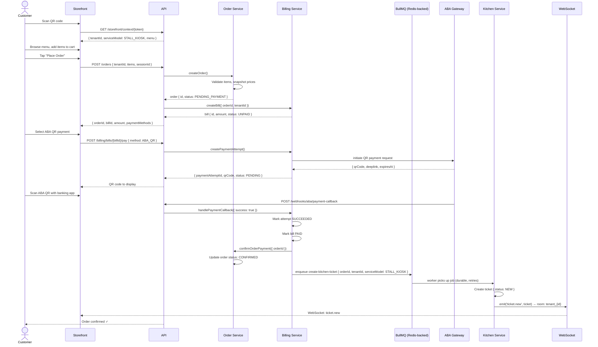

---

## Flow 2 — Dine-In Order (Pay After Service)

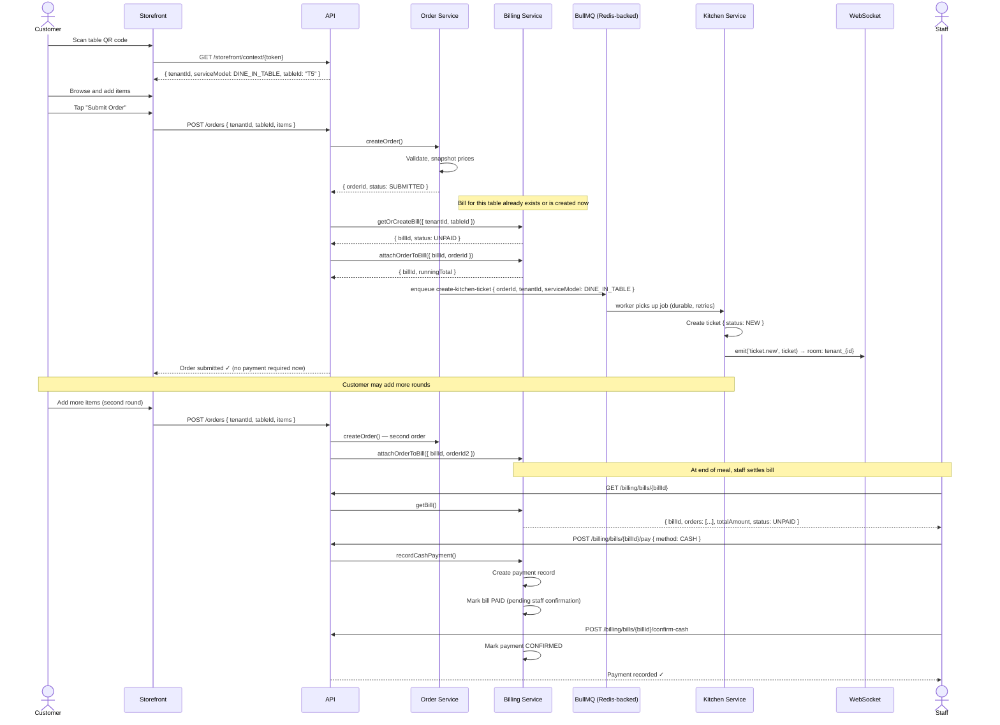

---

## Flow 3 — Kitchen Ticket Lifecycle

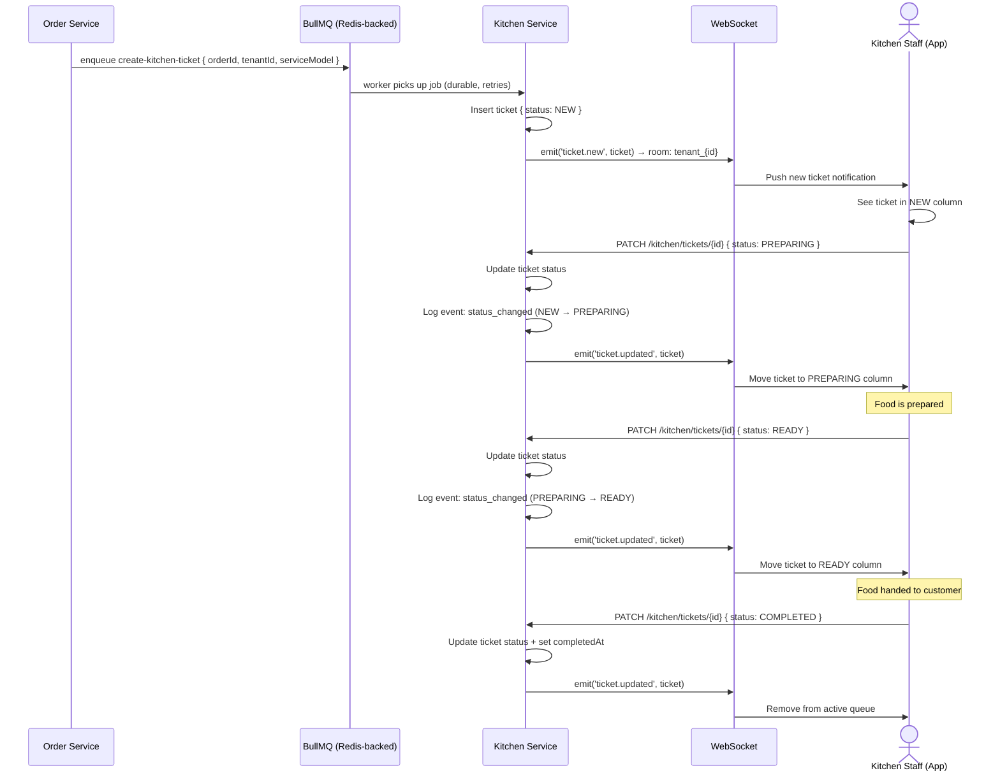

---

## Flow 4 — Merchant Onboarding (Sales-Assisted)

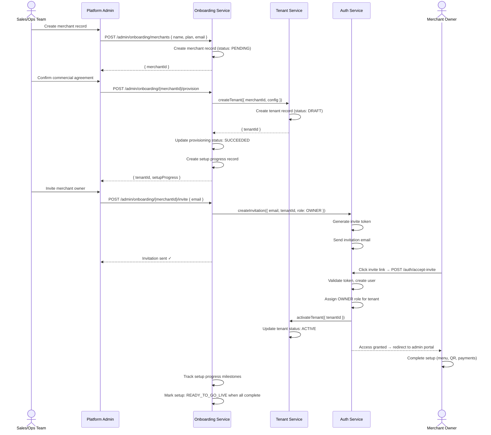

---

## Flow 5 — Authentication and Token Refresh

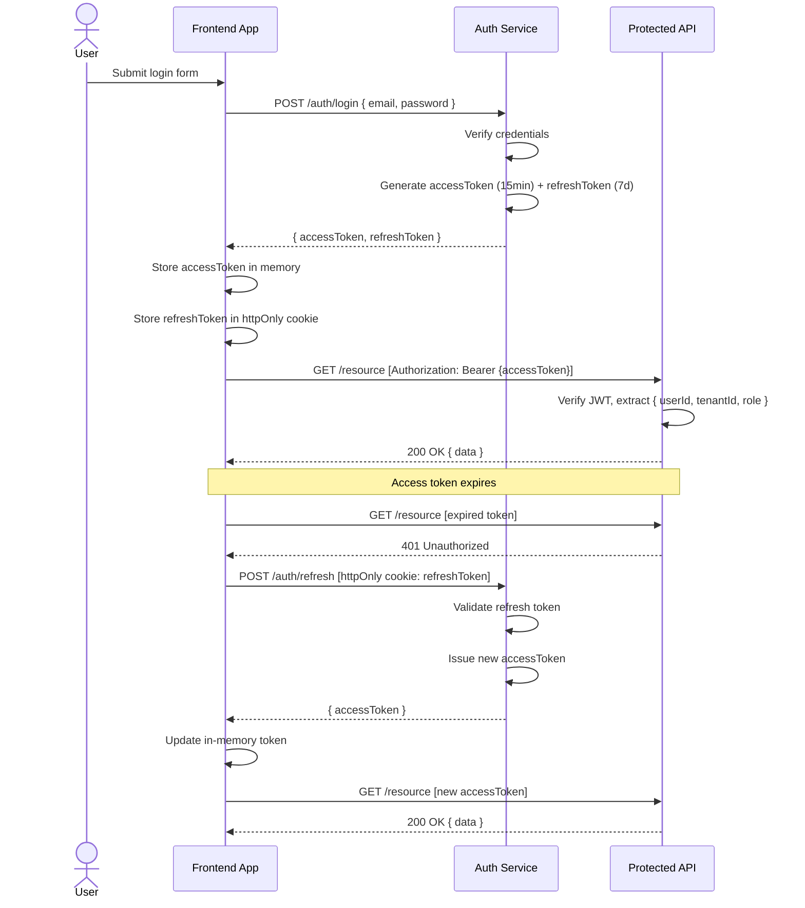

---

## Flow 7 — Kiosk Order with Cash Payment (Counter Confirmation)

> **MVP flow.** Per the PRD §1.3 acceptance checklist, a kiosk cash order reaches the kitchen only after counter staff tap "Confirm Cash Received" in the kitchen app. The order is held in `PENDING_PAYMENT` state (synthetic API label: `PENDING_CASH`) until confirmation; the kitchen ticket is created after `confirmCashPayment` succeeds.

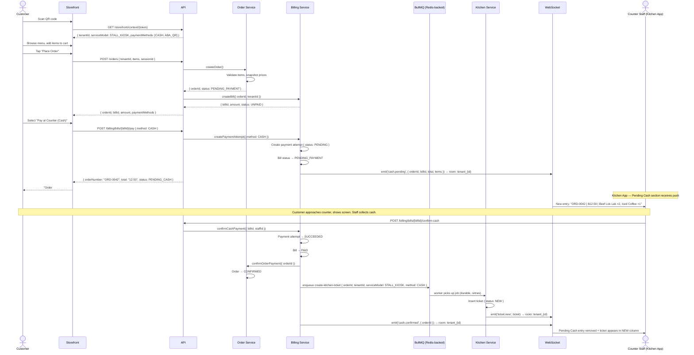

**Key rules:**
- `create-kitchen-ticket` job is only enqueued after `confirmCashPayment` succeeds — never before
- `POST /billing/bills/{billId}/confirm-cash` requires authenticated staff (KITCHEN_STAFF role or above); it is not callable from the customer storefront
- If staff closes the app or disconnects before confirming, the order stays in `PENDING_PAYMENT` — it will reappear in the Pending Cash section on reconnect via a REST fetch on mount
- On confirm failure (network/server error), the Kitchen App must show a clear error and allow retry — never silently mark as confirmed

**Schema note — `status: PENDING_CASH` in the API response:**
`PENDING_CASH` is **NOT** a value in the `orders.status` DB column. It is a synthetic label
computed by the API response layer from two DB fields:
- `order.status = 'PENDING_PAYMENT'`
- `payment.method = 'CASH'`

Do **not** add `PENDING_CASH_PAYMENT` to the `orders` CHECK constraint for this feature.
The existing `PENDING_PAYMENT` status covers this state. The API controller derives the
label: `if (order.status === 'PENDING_PAYMENT' && payment?.method === 'CASH') return 'PENDING_CASH'`.

---

## Flow 8 — Order Status Page (Kiosk Same-Visit Polling)

Customer lands on `/o/{orderToken}` after order confirmation, or taps a link from the "Your orders this visit" banner on a subsequent QR scan.

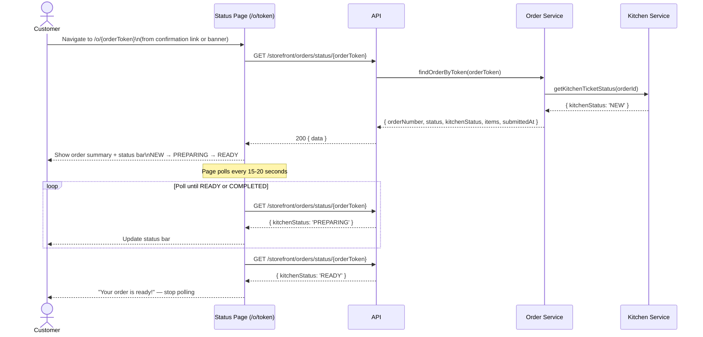

**Rules:**
- Poll only while `kitchenStatus` is `NEW` or `PREPARING` — stop on `READY`, `COMPLETED`, or after 90 minutes
- No auth required; token provides access control
- On network error, show "Checking status…" and retry silently — do not show error to customer

---

## Flow 9 — Kiosk Same-Visit Banner (localStorage Recovery)

Customer re-scans the same kiosk QR after having already ordered during the same visit.

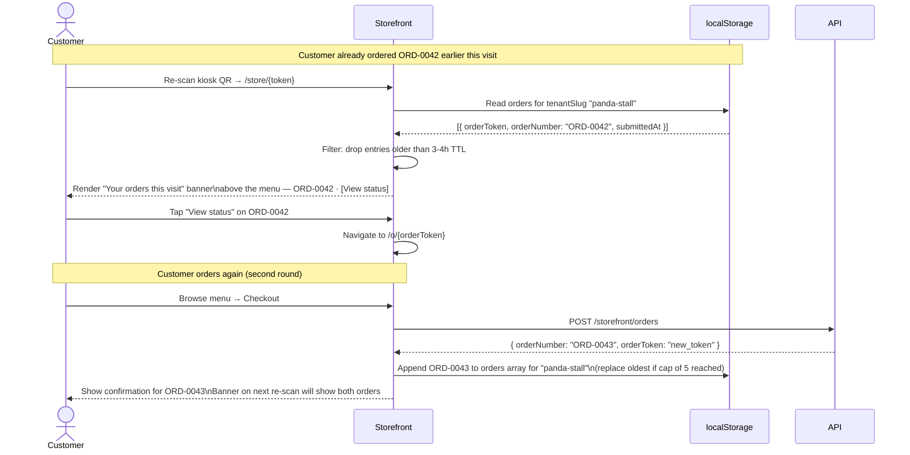

---

## Flow 6 — QR Context Resolution

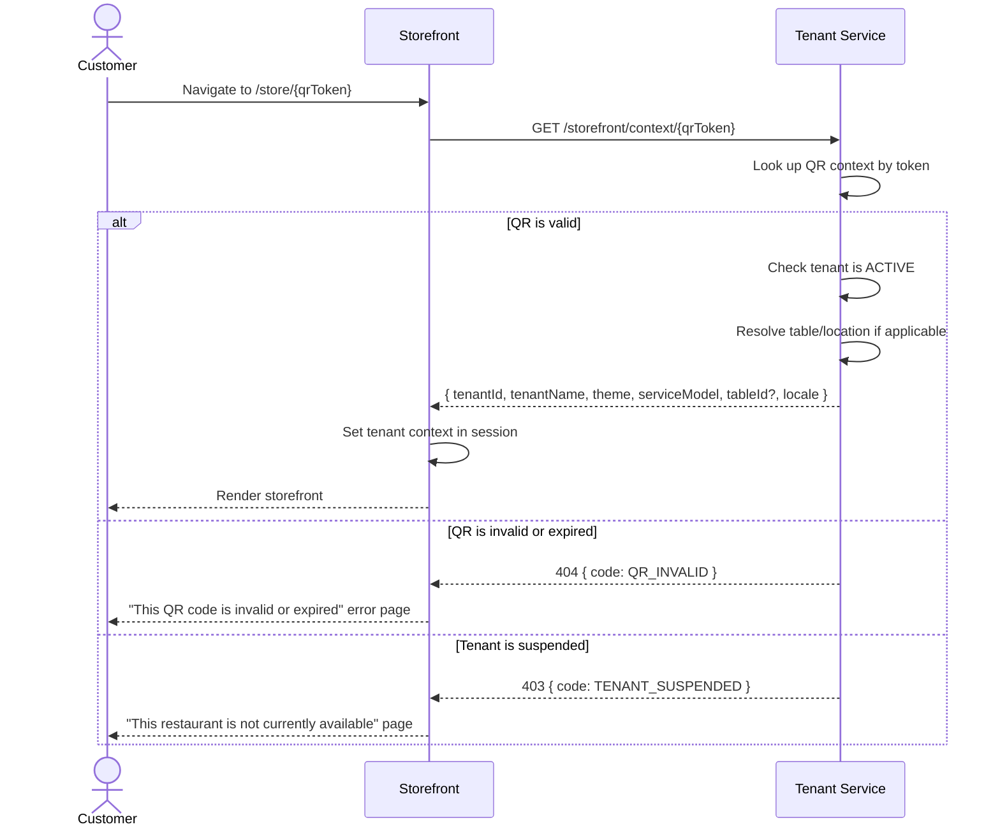

---

## File Mapping Reference

This section maps each sequence-diagram flow above to the exact files in the `xfos/` scaffold. Use it as a scaffold-walker when you are new to the codebase — every flow touches these files in order.

### Flow A — Browse Menu (`GET /api/v1/storefront/context/:slug`)

**System overview:**

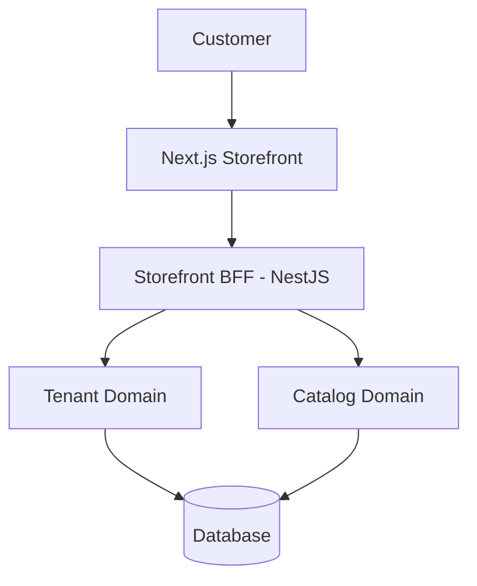

**Frontend:**

```
xfos/frontend/storefront/src/app/[locale]/(qr)/[tenantSlug]/page.tsx
xfos/frontend/storefront/src/features/menu-browse/hooks/useMenu.ts
xfos/frontend/storefront/src/features/menu-browse/api.ts        ← composes lib/api/storefront.ts
xfos/frontend/storefront/src/lib/api/storefront.ts              ← THE BFF client (only file calling apiFetch)
```

**Backend:**

```
xfos/backend/api/src/modules/storefront/api/storefront.controller.ts
xfos/backend/api/src/modules/storefront/application/use-cases/get-storefront-context.use-case.ts

xfos/backend/api/src/domains/tenant/application/queries/get-tenant-by-slug.query.ts
xfos/backend/api/src/domains/catalog/application/queries/get-public-menu.query.ts
```

**Key code — the BFF use case:**

```ts
// modules/storefront/application/use-cases/get-storefront-context.use-case.ts
async execute({ slug }: { slug: string }) {
  const tenant = await this.tenantPort.getBySlug(slug)
  const menu   = await this.catalogPort.getMenu(tenant.id)
  return { tenant, menu }
}
```

The BFF use case calls domain ports via DI — never over HTTP. The domain owns "what a menu is." The BFF owns "what the storefront needs to render it."

---

### Flow B — Submit Order + Payment (`POST /api/v1/storefront/orders`)

**System overview:**

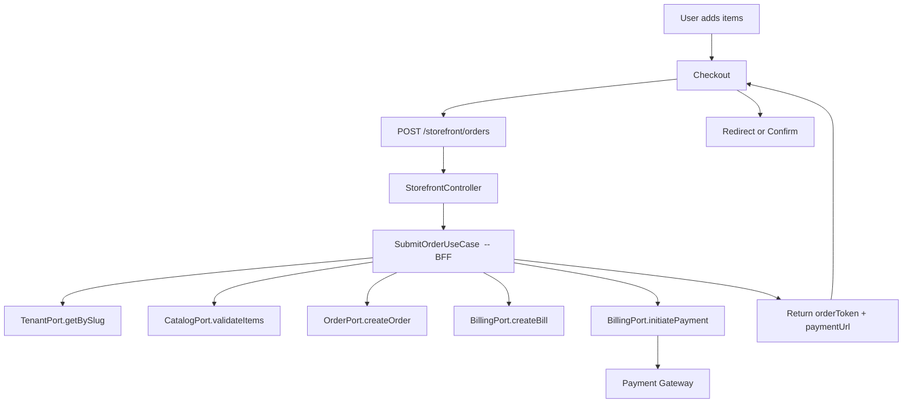

**Frontend:**

```
xfos/frontend/storefront/src/features/cart/use-cart.hook.ts
xfos/frontend/storefront/src/features/checkout/use-submit-order.hook.ts
xfos/frontend/storefront/src/features/checkout/api.ts
xfos/frontend/storefront/src/lib/api/storefront.ts            ← only file calling apiFetch
```

**Backend — BFF module (orchestrator):**

```
xfos/backend/api/src/modules/storefront/api/storefront.controller.ts
xfos/backend/api/src/modules/storefront/application/use-cases/submit-order.use-case.ts
xfos/backend/api/src/modules/storefront/application/dto/submit-order.dto.ts
```

**Backend — Domain modules (the truth):**

```
xfos/backend/api/src/domains/order/application/use-cases/create-order.use-case.ts
xfos/backend/api/src/domains/billing/application/use-cases/create-bill.use-case.ts
xfos/backend/api/src/domains/billing/application/use-cases/initiate-payment.use-case.ts
xfos/backend/api/src/domains/catalog/application/queries/validate-items.query.ts
```

**Key code — the BFF submit-order use case:**

```ts
// modules/storefront/application/use-cases/submit-order.use-case.ts
async execute(input: SubmitOrderInput) {
  const tenant = await this.tenantPort.getBySlug(input.tenantSlug)
  const items  = await this.catalogPort.validateItems(input.items)

  const order  = await this.orderPort.createOrder({
    tenantId: tenant.id,
    items,
  })

  const bill   = await this.billingPort.createBill({
    orderId: order.id,
    amount:  order.total,
  })

  let payment = null
  if (input.paymentMethod !== 'CASH') {
    payment = await this.billingPort.initiatePayment({ billId: bill.id })
  }

  return {
    orderToken: order.token,
    paymentUrl: payment?.url ?? null,
  }
}
```

---

### Critical Rules — What Every Flow Must Obey

**Idempotency.** Every `POST` that creates state must accept an `Idempotency-Key` header:

```http
POST /api/v1/storefront/orders
Idempotency-Key: 8f2a7b6e-...
```

Replay of the same key returns the same result, never a duplicate.

**No rollback across domains.** If `createBill` succeeds and `initiatePayment` fails, the order and bill **stay**. The customer retries payment. Do not cascade-delete — it corrupts audit trails.

**Ownership — who decides what:**

| Logic | Owner |
|---|---|
| Pricing | Order domain |
| Payment | Billing domain |
| Menu validation | Catalog domain |
| Ticket creation | Kitchen domain |
| Tenant resolution | Tenant domain |

**The mental model (every feature fits this):**

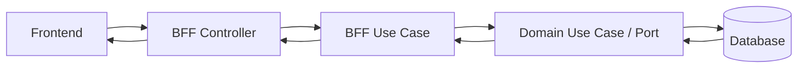

**Change impact — where to edit:**

| Change type | What you edit |
|---|---|
| UI wording / layout | Frontend only |
| Menu business rule (e.g. "items off at 10pm") | `domains/catalog/*` |
| A new API call or response shape | BFF use case + contract |
| A new database field | Prisma schema → domain entity → repository → use case → contract |
| Payment provider behavior | `domains/billing/*` |

---

### What to Build Next — Your First Endpoint

If this is your first backend PR, implement these two BFF endpoints first. They exercise every layer without touching payments:

1. `GET /api/v1/storefront/context/:slug` — the menu-browse flow (Flow A above)
2. `POST /api/v1/storefront/orders` — the submit-order flow (Flow B above, MVP path: `paymentMethod = CASH`, no payment gateway call)

Test them with retries, duplicate requests (idempotency), and a failing tenant (404). This is where the architecture becomes real — not theoretical.
