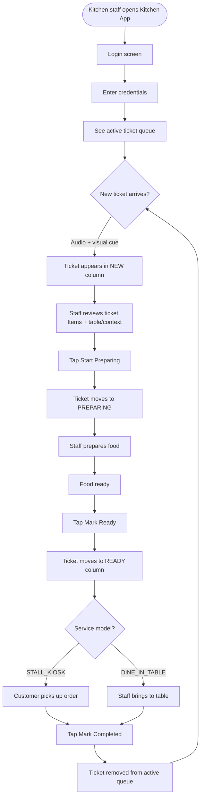

# Kitchen App — User Flows

## Actors

| Actor | Surface | Goal |
|---|---|---|
| **End Customer** | Storefront (mobile web) | Order food, pay |
| **Kitchen Staff** | Kitchen App (tablet) | Receive and fulfill orders |
| **Merchant Owner** | Tenant Admin Portal | Configure and manage restaurant |
| **Sales/Ops Team** | Platform Admin Portal | Onboard and manage merchants |

---

## Flow 3 — Kitchen Staff: Daily Operations Journey

### Journey Map

```
Start of Shift → Orders Arrive → Prepare → Complete → End of Shift

Login          → See NEW queue → Tap       → Tap READY  → Log out
                 (notification) PREPARING
Feeling:         Focused         Working    Satisfied
```

### Process Flow



---

## Flow 9 — Call Staff Bell

Customer needs assistance and taps the Help tab in the bottom navigation. Available across all service models; can be disabled per tenant.

```mermaid
flowchart TD
    A([Customer needs assistance]) --> B[Tap Help tab in bottom navigation]
    B --> C[Confirmation sheet slides up:\nCall a staff member?]
    C --> D{Customer confirms}

    D -->|Yes, call staff| E[POST /storefront/sessions/{sessionId}/call-staff\npayload: tableRef + serviceModel + sentAt]
    E --> F[WebSocket emits staff.callRequested\n→ room tenant_{id} → kitchen app]
    F --> G[Customer sees: Staff has been notified.\nHelp tab disabled for 2-min cooldown]

    F --> H[Kitchen app: persistent alert card\nappears at top of board — above food tickets]
    H --> I[Alert: HELP NEEDED · Table T5 · time ago]
    I --> J{Staff responds}
    J -->|Taps Dismiss| K[Alert removed from board]
    J -->|Ignores| L[Alert stays until dismissed]

    D -->|Cancel| M([Sheet dismissed — no signal sent])
```

**Rules:**
- Cooldown of 2 minutes prevents repeated signals from the same session
- For dine-in: alert shows table reference (`Table T5`)
- For kiosk / open-tab: alert shows "Counter customer needs help"
- Can be disabled per tenant: `call_staff_enabled: false`

---

## User Journey: Emotions and Pain Points

### Kitchen Staff Pain Points

| Pain Point | Our Solution |
|---|---|
| "I miss orders during busy periods" | Audio + visual new order alert |
| "I can't see which table it's for" | Table ref shown prominently on ticket |
| "Did I already start this?" | Clear status columns: NEW / PREPARING / READY |
| "The screen froze" | WebSocket reconnects automatically |
