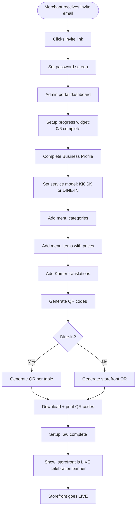
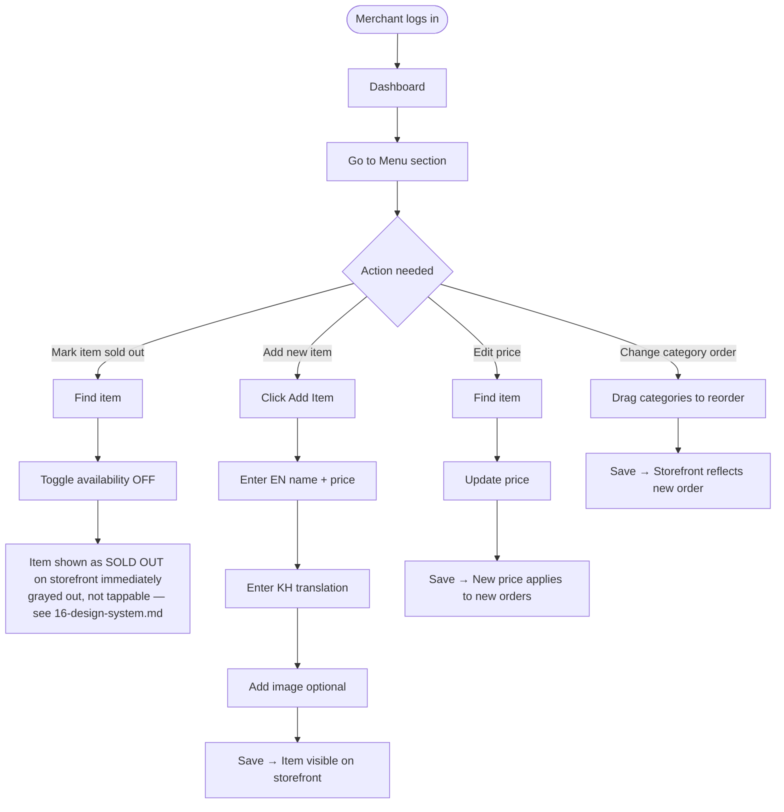

# Merchant Portal — User Flows

## Actors

| Actor | Surface | Goal |
|---|---|---|
| **End Customer** | Storefront (mobile web) | Order food, pay |
| **Kitchen Staff** | Kitchen App (tablet) | Receive and fulfill orders |
| **Merchant Owner** | Tenant Admin Portal | Configure and manage restaurant |
| **Sales/Ops Team** | Platform Admin Portal | Onboard and manage merchants |

---

## Flow 4 — Merchant Owner: Initial Setup Journey

### Setup Checklist Progress (6 steps — source of truth)

```
Step 1: Business Profile ── Name, logo, description ──── ○
Step 2: Service Model    ── Kiosk or Dine-In ─────────── ○
Step 3: Menu             ── Add categories + items ────── ○
Step 4: Translations     ── Khmer + English content ───── ○
Step 5: QR Codes         ── Generate and print ──────────── ○
Step 6: Go Live!         ── All steps complete ──────────── ✓
```

> Note: Payment method configuration (cash / ABA QR) is part of MVP setup. See PRD §1.2.1 and `shared/10-aba-payment.md`.
> See `../shared/11-design-system.md` for the UI specification of this checklist and the Go Live celebration state.

### Setup Flow



---

## Flow 5 — Merchant Owner: Daily Menu Management



---

## User Journey: Emotions and Pain Points

### Merchant Owner Pain Points

| Pain Point | Our Solution |
|---|---|
| "Setting up is confusing" | Step-by-step setup checklist with progress |
| "I changed a price and broke something" | Validation before save, preview available |
| "I need to mark an item sold out quickly" | One toggle, instant effect |
| "I don't know if my storefront is live" | Dashboard shows storefront status clearly |
