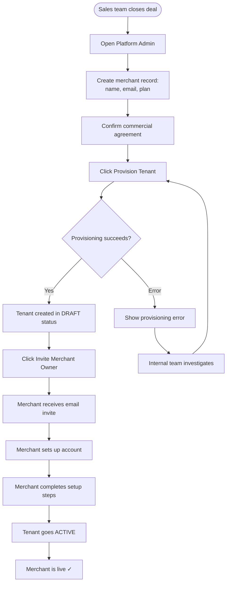

# Platform Portal — User Flows

## Actors

| Actor | Surface | Goal |
|---|---|---|
| **End Customer** | Storefront (mobile web) | Order food, pay |
| **Kitchen Staff** | Kitchen App (tablet) | Receive and fulfill orders |
| **Merchant Owner** | Tenant Admin Portal | Configure and manage restaurant |
| **Sales/Ops Team** | Platform Admin Portal | Onboard and manage merchants |

---

## Flow 6 — Sales Team: Merchant Onboarding

