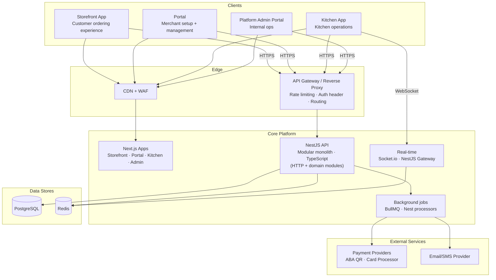
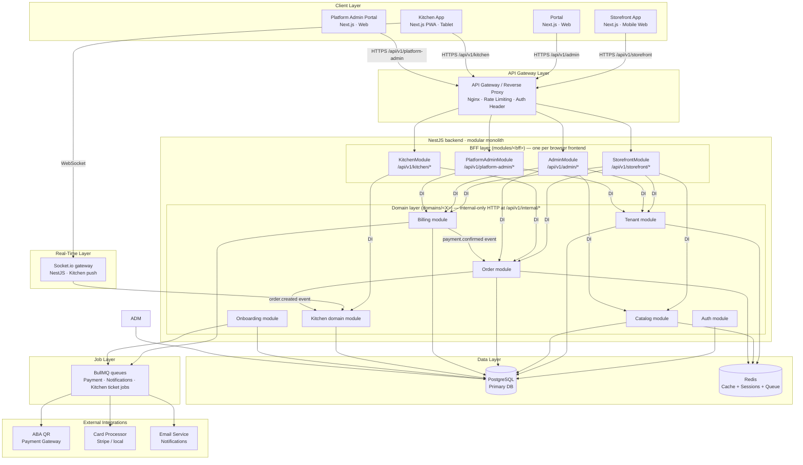
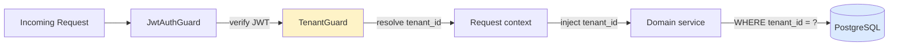
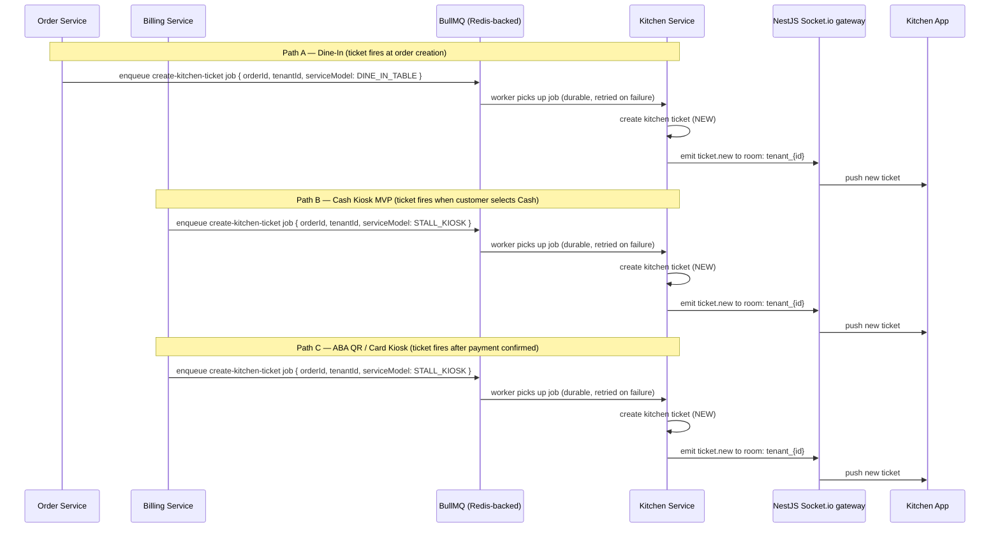

# 02 — Architecture Diagram

> **Updated for ADR-008 (BFF-per-frontend, 2026-04-09).** The NestJS backend now exposes **two HTTP surfaces**:
>
> 1. **Public BFF surfaces** (`/api/v1/<bff>/*`) — one per browser frontend, lives in `backend/api/src/modules/<bff>/`. The frontend may call ONLY its BFF.
> 2. **Internal domain surfaces** (`/api/v1/internal/<domain>/*`) — for scripts and integrations, lives in `backend/api/src/domains/<domain>/api/`. Behind URL prefix + `ServiceTokenGuard` + `InternalOnlyGuard`.
>
> BFF use cases call domain use cases via DI (NOT via HTTP between modules). See `09-decisions-adrs.md` ADR-008 and `folder_structure_and_decision.md` §12.3a.

**Backend stack (MVP):** **NestJS** + **TypeScript**. The HTTP API, BFF modules, domain modules, guards, and Socket.io gateway run in one NestJS application (Node.js is the runtime only).

## High-Level System Architecture



---

## System Architecture Overview



---

## Domain Responsibilities

Domains live in `backend/api/src/domains/<X>/`. They own business rules and entities. They expose internal HTTP routes under `/api/v1/internal/<X>/*` (3-walled, service-token only). **They do NOT call each other directly** — cross-domain coordination happens in BFF use cases or via in-process events.

| Domain | Owns | Called by which BFFs |
|---|---|---|
| `domains/auth` | JWT tokens, sessions, user identity | (cross-cutting — `/api/v1/auth/*` shared across all frontends) |
| `domains/tenant` | Tenant config, settings, theme, QR contexts | storefront, admin, platform-admin |
| `domains/catalog` | Categories, items, translations, availability | storefront, admin |
| `domains/order` | Orders, order items, order lifecycle | storefront, kitchen, admin, platform-admin |
| `domains/billing` | Bills, payments, payment attempts, settlement | storefront (pay-now), admin (reporting), platform-admin (cross-tenant) |
| `domains/kitchen` | Kitchen tickets, workflow states, readiness | kitchen, admin (order monitoring) |
| `domains/onboarding` | Plans, subscriptions, provisioning, activation | admin, platform-admin |

## BFF Module Responsibilities

BFFs live in `backend/api/src/modules/<bff>/`. They own NO entities or business rules — pure orchestration of domain use cases into UI-projected responses.

| BFF Module | Frontend it serves | Domains it imports |
|---|---|---|
| `modules/storefront` | `frontend/storefront` | tenant, catalog, order, billing |
| `modules/kitchen` | `frontend/kitchen` | kitchen, order |
| `modules/admin` | `frontend/admin` | catalog, order, billing, tenant, onboarding |
| `modules/platform-admin` | `frontend/platform-admin` | tenant, billing, onboarding |

---

## Multi-Tenant Isolation Model



Every DB query on tenant-bound data **must** include `WHERE tenant_id = :tenantId`. This is enforced in repositories, not left to convention. Tenant and JWT checks run as **NestJS guards** (and related pipeline hooks), not ad-hoc framework-specific middleware.

---

## Data Flow — Kiosk Order (Pay Before)

```
Customer → QR Scan → Storefront loads (tenant + menu)
       → Cart built → Checkout
       → Order created (PENDING_PAYMENT)
       → Bill created (UNPAID)
       → Customer selects payment method
       → Payment attempt created (PENDING)
       → [ABA QR / Card] → Payment confirmed
       → Bill marked PAID
       → Order status → CONFIRMED
       → Kitchen ticket created (NEW)   ← AFTER payment confirmation
       → Kitchen: PREPARING → READY → COMPLETED
```

> **KIOSK RULE:** Kitchen ticket creation depends on payment method:
>
> | Payment method | MVP behaviour | Trigger |
> |---|---|---|
> | ABA QR / Card | Ticket created AFTER payment confirmed | `payment.confirmed` webhook → Billing Service → `createKitchenTicket()` |
> | Cash (MVP) | Ticket created IMMEDIATELY when cash payment is initiated | `POST /billing/bills/:billId/pay { method: CASH }` → Billing Service → `createKitchenTicket()` |
>
> **Why Billing Service fires the cash ticket (not Order Service):** The payment method is
> unknown at order creation — the customer selects Cash at the payment step. Firing from
> Billing Service after `pay { method: CASH }` is the first moment the service model +
> payment method combination is both known and confirmed. Order Service never sees the
> method selection directly.
>
> Rationale: In MVP the kiosk ticket is created only after payment is confirmed
> (see PRD §1.3 acceptance checklist). ABA QR is confirmed via webhook; cash is confirmed
> by counter staff tapping "Confirm Cash Received" in the kitchen app (`PENDING_CASH`
> gate). The kitchen ticket is enqueued via BullMQ after confirmation and surfaced via the
> `ticket.new` Socket.io event. See Flow 1 (ABA) and Flow 7 (cash) in
> `02-sequence-diagrams.md`.

---

## Data Flow — Dine-In Order (Pay After)

```
Customer → Table QR scan → Storefront loads (tenant + table context)
       → Cart built → Submit order
       → Order created (SUBMITTED)
       → Kitchen ticket created (NEW)   ← IMMEDIATELY on order submit
       → Kitchen: PREPARING → READY
       → [Customer may add more rounds, each creates another ticket]
       → Bill accumulates all orders (UNPAID)
       → End of meal: Staff collects payment
       → Payment recorded → Bill marked PAID
```

> **DINE-IN RULE:** Kitchen ticket is created immediately on order submission.
> Trigger: `order.created` event (status = SUBMITTED) → `createKitchenTicket()`.
> Rationale: Food preparation starts right away; payment happens at end of meal.

> **CRITICAL:** The `createKitchenTicket` trigger differs by service model AND payment method:
> - `service_model = DINE_IN_TABLE` → Order Service enqueues `create-kitchen-ticket` job immediately on `order.created`
> - `service_model = STALL_KIOSK + method = ABA_QR / CARD` → Billing Service enqueues job after `payment.confirmed` webhook
> - `service_model = STALL_KIOSK + method = CASH` → Billing Service enqueues job immediately when `POST /billing/bills/:billId/pay { method: CASH }` is processed
>
> Order Service never fires `createKitchenTicket` for kiosk orders — it has no visibility into
> the payment method selected. Billing Service owns the kiosk ticket trigger in both cash and
> digital paths.

---

## Real-Time Architecture (Kitchen)



> **WHY BullMQ, NOT Redis pub/sub:** Redis pub/sub is fire-and-forget. If the Kitchen Service
> worker is restarting at the moment Order or Billing Service emits, the event is silently
> dropped and no kitchen ticket is ever created — a silent order loss. BullMQ (already in
> the stack for payment/notification jobs) persists jobs in Redis and retries on failure.
> Use `createKitchenTicketQueue` with `attempts: 3, backoff: { type: 'exponential', delay: 500 }`.
> Do NOT use raw `redis.publish()` for the order→kitchen handoff.

---

## Deployment Architecture (MVP)

```
┌─────────────────────────────────────────────┐
│                 Cloud Provider               │
│  (Render / Railway / Fly.io / AWS)           │
│                                              │
│  ┌──────────────┐  ┌──────────────┐  ┌──────────────┐  ┌──────────────┐
│  │ Storefront   │  │   Portal     │  │   Kitchen    │  │ Platform     │
│  │ App (Next.js)│  │ (Next.js)    │  │ App (Next.js)│  │ Admin (Next.js)│
│  └──────────────┘  └──────────────┘  └──────────────┘  └──────────────┘
│                                              │
│  ┌──────────────────────────────────────┐   │
│  │     Backend API (NestJS + Socket.io)   │   │
│  └──────────────────────────────────────┘   │
│                                              │
│  ┌─────────────┐    ┌─────────────────┐     │
│  │ PostgreSQL  │    │     Redis        │     │
│  │  (managed) │    │   (managed)      │     │
│  └─────────────┘    └─────────────────┘     │
└─────────────────────────────────────────────┘
```

**MVP deployment targets:**
- Frontends: Vercel (zero-config Next.js deployment)
- API: Railway or Fly.io (NestJS app — container / Node runtime)
- PostgreSQL: Supabase DB only (PostgreSQL-as-a-service, no Supabase Auth/SDK)
- Redis: Upstash (serverless Redis)

> **MVP DEPLOYMENT TRUTH (single source):**
> - **Socket.io runs in the same NestJS API runtime** (no separate realtime service for MVP).
> - **Kitchen ticket creation is queue-driven**: Order/Billing enqueue `create-kitchen-ticket` in BullMQ, then a worker/processor in the backend consumes and creates tickets.
> - **Source of truth is PostgreSQL**; WebSocket events are a live update layer only.
> - If we split realtime or workers into dedicated services later, update this section first before changing other docs.

> **SINGLE-INSTANCE CONSTRAINT (MVP):** The Socket.io server requires sticky sessions or a
> Redis adapter (`@socket.io/redis-adapter`) to operate correctly across multiple API instances.
> **Do not scale the API to more than 1 instance without first configuring the Redis adapter.**
> Scaling to 2+ instances without this causes kitchen ticket updates to silently drop for clients
> connected to a different instance. For Phase 1, enforce `MAX_REPLICAS=1` in the deployment config.
> See TODOS.md for the Redis adapter upgrade task.

---

## Phase 1 Tech Stack Summary

| Layer | Technology | Reason |
|---|---|---|
| Frontend framework | Next.js 14 (App Router) | Full-stack, RSC, best DX |
| Backend API | NestJS + TypeScript | Modular architecture, DI, production-ready patterns; runs on Node.js |
| ORM | Prisma | Type-safe, great migrations |
| Database | PostgreSQL | Relational, multi-tenant safe |
| Cache | Redis (Upstash) | Sessions, queue, pub-sub |
| Real-time | Socket.io | Kitchen live updates |
| Auth | JWT (access + refresh) | Stateless, tenant-aware |
| UI components | shadcn/ui + Tailwind CSS | Fast, consistent |
| Validation | Zod | Runtime + compile-time |
| Queue | BullMQ (Redis) | Reliable job processing |
| Monorepo | pnpm + Turborepo | Fast builds, shared packages |
| i18n | next-intl | Khmer + English |
