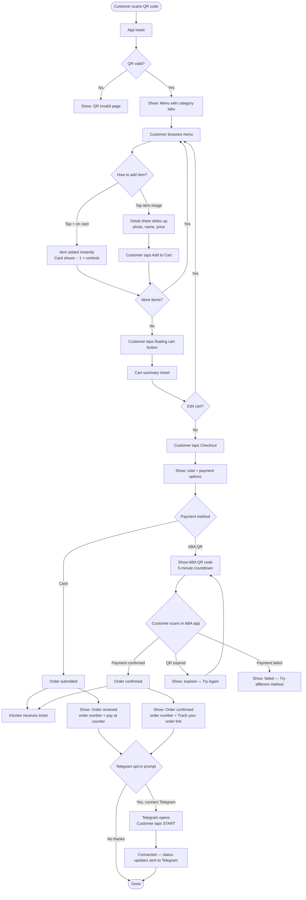
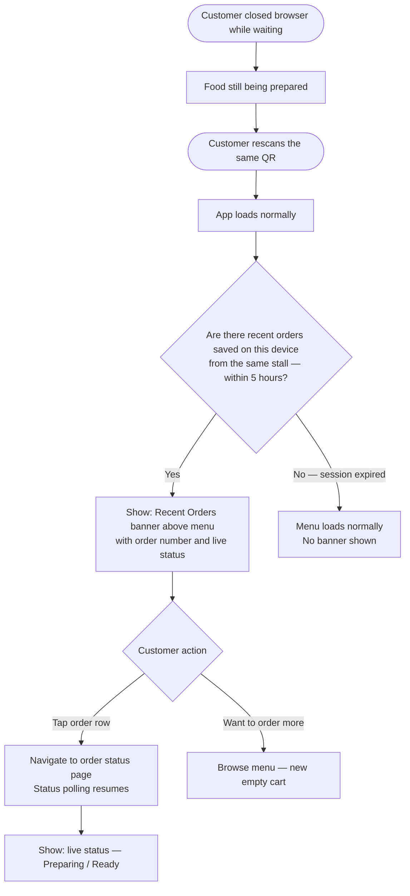
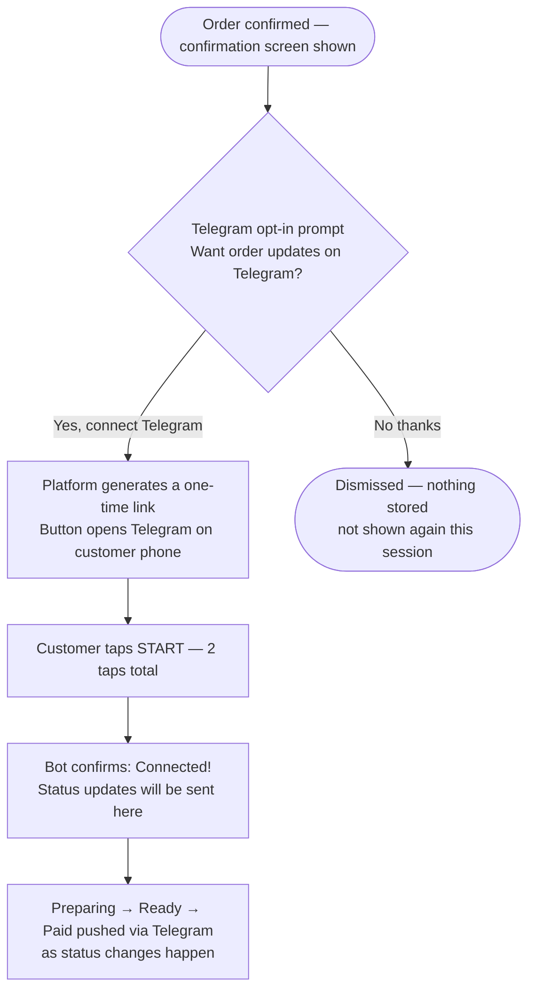
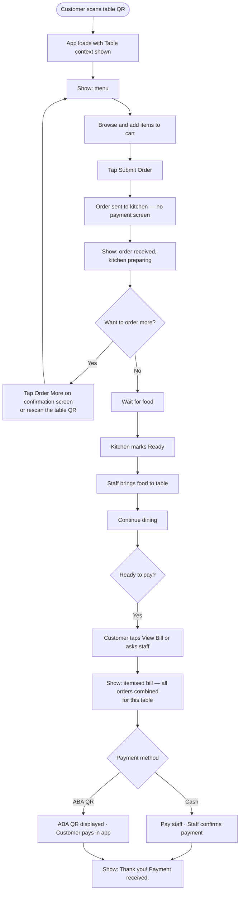
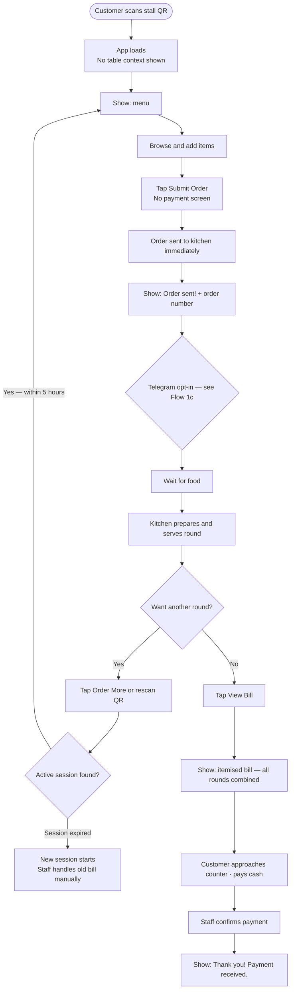
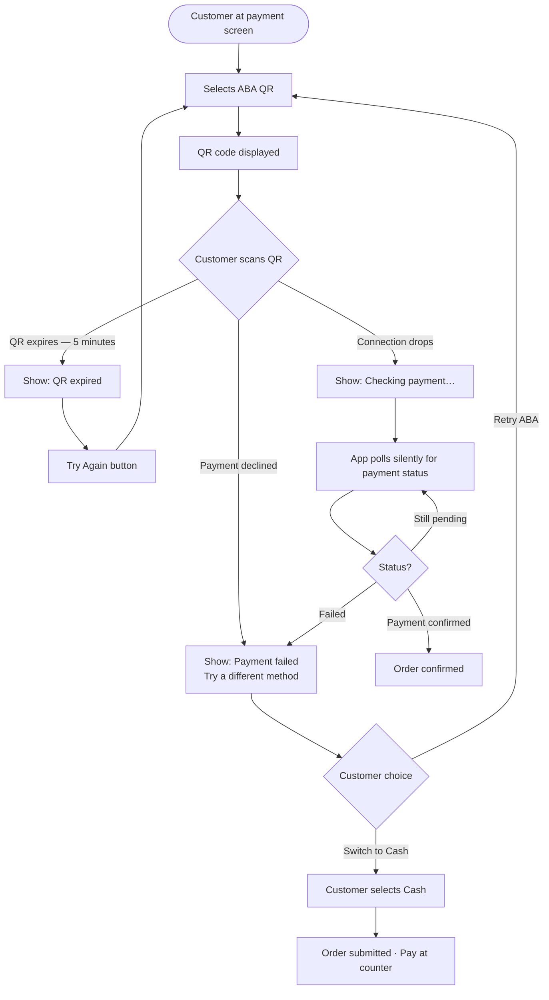
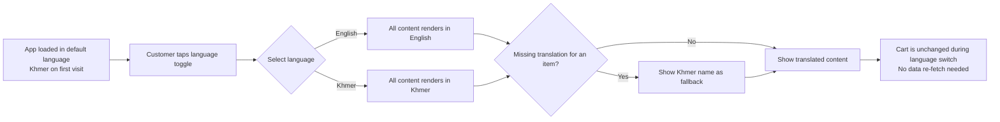

# Storefront — User Flows

These diagrams cover the main paths a customer takes through the app. Each flow is self-contained.

---

## Flow 1 — Kiosk Order Journey

The core ordering flow: scan QR → browse → cart → pay → confirmation.



---

## Flow 1b — Session Recovery (Browser Closed → QR Rescan)

Customer closed the browser while waiting. They rescan the QR to check their order.



> If the customer already connected Telegram: they received Preparing and Ready notifications in their Telegram chat — they may not need to rescan at all.

**What's stored on the device:** After each order submission, a slim reference is appended to `localStorage["orders:{tenantId}"]`. Full order details are always fetched from the server — the device only stores enough to know which orders to look up.

```json
[
  { "orderId": "uuid-0042", "orderNumber": "ORD-0042", "submittedAt": "2026-03-25T12:30:00Z" },
  { "orderId": "uuid-0043", "orderNumber": "ORD-0043", "submittedAt": "2026-03-25T12:55:00Z" }
]
```

Rules: entries expire after 5h · max 20 entries per tenant key · cart is NOT in this list (cart is in-memory React state only).

---

## Flow 1c — Telegram Opt-In

Shown after every successful order submission. Never shown during checkout or payment.



---

## Flow 2 — Dine-In Table Journey

Order now, pay later. Multiple rounds on a single bill.



---

## Flow 2b — Open-Tab Stall Journey

Order multiple rounds, no table number, pay once at the end.



---

## Flow 3 — ABA Payment Failure Recovery

What happens when ABA payment doesn't go through.



---

## Flow 4 — Language Switch

Customer can switch between Khmer and English at any point.



---

## Customer Pain Points and How We Address Them

| Pain Point | Our Solution |
|---|---|
| "I can't read the menu" | Khmer + English with a one-tap language toggle |
| "I don't know how to pay" | Clear payment method screen, step-by-step ABA QR flow |
| "Did my order actually go through?" | Immediate confirmation screen with order number |
| "The QR didn't work" | Clear error page — not a blank screen |
| "I don't want to create an account" | Guest ordering — no signup, no login |
| "I closed my browser and lost my order" | Rescan the QR → Recent Orders banner → live status |
| "I don't know when my food is ready" | Telegram push notification + in-app banner + vibration |
| "I need help but don't want to shout" | Call Staff bell → kitchen alert card in under 2 seconds |
